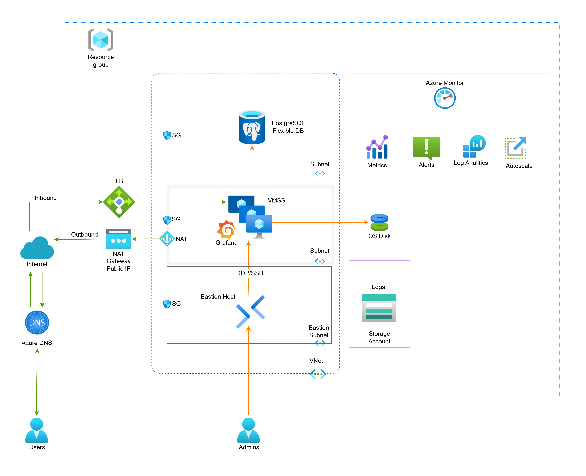

# 🚀 Project-401: Grafana Service deployed on Azure VMSS connected to a Load Balancer, PostgreSQL Flexible DB, VNet Components, Azure DNS, NAT Gateway, Bastion, Storage Account, and Azure Monitor using Azure Entra ID to manage identities.

## 🔧 Prerequisites
- Azure CLI installed and logged in (`az login`)
- An active Azure subscription
- Sufficient IAM permissions: Contributor + User Access Administrator

## 🎯 Description
This project demonstrates how to deliver **Grafana as a Service** deployed on Azure.  

This project is deploying:
- **VM Scale Set (VMSS)** running Grafana  
- A dedicated **PostgreSQL Flexible Server** for persistence  
- Access through an **Azure Load Balancer** and **Azure DNS**  
- **Azure NAT Gateway** for outbound Internet traffic  
- **Azure Bastion Host** for secure admin access (SSH/RDP)  
- **Azure Storage Account** for log storage  
- **Azure Monitor** for metrics, alerts, autoscale, and log analytics  
- Authentication via **Azure Entra ID** (OAuth2)  

Possible to extend to multiple customers and turn into a **Grafana as a Service** product.

---

## 🏗️ High-Level Architecture

- **Resource Group** → groups customer resources  
- **Virtual Network (VNet) & Subnets** → network isolation for DB, VMSS, and Bastion  
- **Azure VMSS (Linux)** → hosts scalable Grafana OSS instances  
- **Azure Database for PostgreSQL Flexible Server** → external DB for Grafana dashboards and configuration  
- **Azure Load Balancer** → distributes traffic to Grafana VMSS instances  
- **Azure NAT Gateway** → provides outbound Internet access for VMs  
- **Azure Bastion** → secure admin access (SSH/RDP) without exposing public IPs  
- **Azure Storage Account** → central log storage for Grafana and infrastructure logs  
- **Azure Monitor** → observability stack for metrics, alerts, autoscaling, and log analytics  
- **Azure Entra ID** → provides secure login and SSO for users  
- **Azure DNS** → friendly domain name resolution for end-users  

---

## ✨ Key Features  
- **Scalability:** Grafana runs on **VMSS** with autoscaling via Azure Monitor  
- **Database Isolation:** Each customer has their own PostgreSQL Flexible DB  
- **Authentication:** Integrated with **Azure Entra ID** for enterprise SSO  
- **Secure Access:** Bastion provides hardened administrative access  
- **Monitoring & Logging:** Metrics, logs, and alerts collected with Azure Monitor + Log Analytics  
- **Extensibility:** Can evolve towards App Gateway with WAF, containerized Grafana on AKS, or multi-region deployments  

---

## ✅ Expected Outcomes
By using this project, students and practitioners will:
- Deploy **Grafana OSS** backed by a managed PostgreSQL Flexible DB  
- Implement **secure and scalable infrastructure** with VMSS + Load Balancer  
- Gain experience integrating **Azure NAT Gateway, Bastion, and Storage Accounts**  
- Learn **observability practices** using Azure Monitor (metrics, logs, alerts, autoscale)  
- Enable **secure login** with Azure Entra ID  
- Understand how to design and scale a **multi-tenant SaaS system** on Azure  
- Explore automation patterns for **customer onboarding and scaling**  

---

## 📚 References
- [Azure Database for PostgreSQL Flexible Server](https://learn.microsoft.com/en-us/azure/postgresql/flexible-server/)  
- [Grafana installation guide](https://grafana.com/docs/grafana/latest/setup-grafana/installation/)  
- [Grafana OAuth2 Generic Authentication](https://grafana.com/docs/grafana/latest/setup-grafana/configure-security/configure-authentication/oauth/)  
- [Microsoft Docs: Register an app with Microsoft identity platform](https://learn.microsoft.com/en-us/azure/active-directory/develop/quickstart-register-app)  
- [Microsoft Docs: Configure SSO with Grafana](https://learn.microsoft.com/en-us/azure/active-directory/saas-apps/grafana-tutorial)  
- [Azure Bastion Documentation](https://learn.microsoft.com/en-us/azure/bastion/bastion-overview)  
- [Azure NAT Gateway Documentation](https://learn.microsoft.com/en-us/azure/virtual-network/nat-gateway/nat-overview)  
- [Azure Monitor Documentation](https://learn.microsoft.com/en-us/azure/azure-monitor/overview)  

---

## 🧱 Project Setup: Network & Foundational Components

Before deploying VMs, databases, and Grafana, we first build the networking foundation. These are the steps to create the network components:

### 1. Create Resource Group
- Create a **resource group** to contain all project resources (VNet, subnets, NSGs, NAT, Bastion, etc.).
- Use meaningful naming (e.g. `rg-grafana-prod`) to reflect purpose and lifecycle.
- Keep `East US` as the region. 
- Click Create.

### 2. Provision Virtual Network (VNet) and Bastion
- Select the related subscription and the resource group.
- Create an Azure **Virtual Network** for the project (e.g. `vnet-grafana`).
- Under IP Adresses tab, define an appropriate address space (e.g. `10.0.0.0/16`).
- Under Security tab, select `Enable Azure Bastion` option.
- This VNet will host subnets such as application, database, bastion, etc.

### 3. Define Subnets
- A subnet for Bastion is automatically created during the previous step.
- Open the page of the VNet we just created
- Navigate to `Settings` on the left side menu.
- Open `Subnets`.
- Delete the default Subnet.
- See the Bastion Subnet is already created here.
- Create the subnets to segment the VNet into subnets for different tiers.
- Keep `Subnet purpose` as `Default`
- Assign names and IP ranges as below.

| Subnet Name     | Purpose                                  | Range | Feature |
|-----------------|------------------------------------------|-------|---------|
| **app-subnet**  | Hosts Grafana VMSS and related services  | 10.0.2.0 | |
| **db-subnet**   | Contains the PostgreSQL Flexible Server  | 10.0.3.0 | Enable private subnet |

- Ensure each subnet’s prefix is non-overlapping and sized appropriately.

### 4. Network Security Groups (NSGs)

To enforce subnet-level security, define one NSG per subnet:

#### Database Subnet (`db-subnet`)
- **Purpose:** Restrict access to PostgreSQL Flexible Server.  
- **Rules:**
  - ✅ Allow inbound **5432 (PostgreSQL)** **only from `app-subnet` (VMSS)**  
  - ❌ Deny all other inbound traffic  

#### Application Subnet (`app-subnet`)
- **Purpose:** Host Grafana VMSS and expose it securely.  
- **Rules:**
  - ✅ Allow inbound **22 (SSH)** **only from `bastion-subnet`**  
  - ✅ Allow inbound **80 (HTTP)** from Internet  
  - ✅ Allow inbound **443 (HTTPS)** from Internet  
  - ❌ Deny all other inbound traffic  

#### Bastion Subnet (`bastion-subnet`)
- **Purpose:** Secure entry point for administrators.  
- **Rules:**
  - ✅ Allow inbound **443 (HTTPS)** from Internet so you can open the portal session.
  - ❌ No need to open 22/3389 (Bastion tunnels SSH/RDP internally)  
  - ❌ Deny all other inbound traffic  

### 5. Public IPs and DNS
- Provision **Public IP addresses** for resources that need external access (e.g. Load Balancer frontend, NAT Gateway).
- Reserve **static IPs** when stable DNS records are required.
- Assign a **fully qualified domain name (FQDN)** to public IPs and integrate with **Azure DNS** or an external DNS provider.

### 6. NAT Gateway (Outbound Internet)
- Deploy an **Azure NAT Gateway** to allow outbound Internet connectivity for VMs in private subnets without assigning them public IPs.
- Associate the NAT Gateway with your subnets (e.g. app-subnet, db-subnet).
- Ensures only initiated connections go out, blocking unsolicited inbound traffic by default.

### 7. Diagnostics & Logging Infrastructure
- Provision a **Storage Account** (e.g. `stgdiaglogs`) to store boot diagnostics and VM logs.
- Enable diagnostic settings to send metrics, logs, and activity logs into:
  - **Log Analytics**
  - **Storage**
  - **Azure Monitor**
- Ensures observability and simplifies troubleshooting.

---

## 🔑 Admin Access to VMs

All administrative access to the VM Scale Set (VMSS) instances is done securely via **Azure Bastion**.  
This avoids exposing **SSH (22)** to the Internet.

### 1. SSH via Azure Portal (Browser-Based)
1. Navigate to the VM or VMSS instance in the **Azure Portal**.
2. Click **Connect → Bastion**.
3. Enter your admin username and private key / password.
4. An **SSH session opens directly in your browser**, tunneled over HTTPS (443).

- Bastion connects to the VM’s **private IP on port 22**.
- No public IPs are required on the VMs.

### 2. SSH via Native Client (Optional)
For admins who prefer using their terminal, Azure Bastion also supports native client tunneling.

1. Open a tunnel with Azure CLI:

   ```bash
   az network bastion tunnel --name <bastion-name> \
     --resource-group <rg-name> \
     --target-resource-id <vm-id> \
     --resource-port 22 \
     --port 50022
   ```

2. Connect via SSH through the tunnel:

   ```bash
   ssh -p 50022 <admin-user>@127.0.0.1
   ```

This keeps **port 22 closed to the Internet** while still providing secure SSH access for administrators.

---

## 🖥️ Project Setup: Compute & Application Components

Once networking is in place, we deploy compute, databases, and application services.

### 1. Deploy Azure VM Scale Set (VMSS)
- Create a **Linux-based VMSS** to host Grafana instances.
- Use a custom `cloud-init` or provisioning script to install Grafana (see `cloud-init.yaml`).
- Configure **autoscaling** rules via **Azure Monitor** (scale out on CPU/memory, scale in during low load).
- Place VMSS in **app-subnet**.

### 2. Attach Load Balancer
- Provision an **Azure Load Balancer**.
- Configure:
  - **Frontend IP** (public, with DNS label if needed).
  - **Backend pool** (VMSS instances).
  - **Health probes** (port 3000 for Grafana).
  - **Load-balancing rules** for HTTP/HTTPS traffic.
- Ensures high availability and seamless access to Grafana.

### 3. Provision PostgreSQL Flexible Server
- Deploy **Azure Database for PostgreSQL Flexible Server** in **db-subnet**.
- Enable **VNet integration** to restrict access to internal VNets only.
- Configure **firewall rules** and **admin credentials**.
- Grafana will use this DB for dashboards, users, and data sources.

### 4. Configure Grafana Installation
- Use `cloud-init` to:
  - Install Grafana OSS from the official APT repo.
  - Enable and start `grafana-server` service.
- Optionally, pre-provision:
  - **Data sources** (PostgreSQL, Azure Monitor).
  - **Dashboards** via `/etc/grafana/provisioning/`.

### 5. Integrate with Azure Entra ID
- Register **Grafana app** in Entra ID.
- Configure OAuth2 settings in Grafana (`grafana.ini`).
- Grant necessary permissions (profile, openid, email).
- Enables **SSO** for enterprise users.

### 6. Storage Integration
- Connect VMSS diagnostic logs and Grafana logs to **Azure Storage Account**.
- Optionally send logs to **Log Analytics** for centralized monitoring.

### 7. Monitoring & Autoscale
- Enable **Azure Monitor** for VMSS, PostgreSQL, and Grafana metrics.
- Configure **alerts** (e.g., CPU > 70%).
- Define **autoscale rules** (e.g., scale out when CPU > 70%, scale in when < 30%).
- Create **dashboards** for end-to-end observability.

### 8. Azure DNS Integration
- Create a DNS zone (e.g. `grafana.example.com`).
- Map Load Balancer’s public IP to a friendly domain.
- Users access Grafana securely via FQDN.

---

## 🛡️ Project Setup: Observability & Security

A critical part of the architecture is enabling monitoring, diagnostics, and security logging.

### 1. Create Storage Account
- Go to **Azure Portal → Storage Accounts → Create**.
- Example: `stgdiaglogs`.
- Use **Standard / LRS** for cost-effective log storage.
- This stores **boot diagnostics** and **long-term logs**.

### 2. Enable Diagnostic Settings
- For each resource (VMSS, Load Balancer, PostgreSQL, Bastion):
  - Go to **Monitoring → Diagnostic settings → Add diagnostic setting**.
  - Send metrics/logs to:
    - **Log Analytics workspace** (for query/alerts).
    - **Storage Account** (for long-term retention).
- For VMSS, enable:
  - **Metrics** (CPU, memory, network).
  - **Syslog** for SSH activity.
  - **Boot diagnostics logs**.

### 3. Create Log Analytics Workspace
- Create workspace `law-grafana`.
- Associate with resources in diagnostic settings.
- Central place for logs and queries.

### 4. Collect SSH Attempt Logs
- Ensure **Azure Monitor Agent** is installed on VMSS instances.
- Configure it to collect:
  - Facility: `auth`
  - Severity: `info` or higher
- Example KQL to detect SSH brute-force attempts:
  ```kusto
  Syslog
  | where Facility == "auth"
  | where SyslogMessage contains "Failed password"
  | summarize Attempts = count() by Computer, IPAddress = extract("from ([0-9.]+)", 1, SyslogMessage)
  | order by Attempts desc
  ```

### 5. Create Monitoring Dashboards
- In **Azure Portal → Dashboard → Create**:
  - Add **Metrics tile** for VMSS:
    - Metric: `Percentage CPU`
    - Visualization: Line chart
  - Add **Log Analytics tile** with KQL query (SSH attempts).
  - Save dashboard as `Grafana-Service-Monitoring`.

### 6. Integrate with Grafana (Optional)
- Add **Azure Monitor data source** in Grafana.
- Query metrics and logs directly in Grafana dashboards.
- Share observability with Grafana-as-a-Service tenants.

### 7. Configure Alerts
- Create alerts for:
  - CPU > 70% for 10 min
  - More than 10 failed SSH attempts within 5 min
- Notifications can go to:
  - Email
  - Microsoft Teams
  - PagerDuty or custom webhook

---

## 🔑 Entra ID (Azure Active Directory) Integration for Grafana

To secure Grafana with Azure Entra ID (formerly Azure AD), follow these manual steps:

### 1. Create an App Registration
1. In the Azure Portal, go to **Microsoft Entra ID** → **App registrations** → **New registration**.
2. Set:
   - **Name**: `grafana-app`
   - **Supported account types**: `Accounts in this organizational directory only`
   - **Redirect URI**: `https://<your-grafana-dns>/login/azuread`
3. Click **Register**.

### 2. Configure Authentication
1. In the new app, go to **Authentication**.
2. Add:
   - Redirect URI: `https://<your-grafana-dns>/login/azuread`
   - Logout URL: `https://<your-grafana-dns>/logout`
3. Enable **ID tokens** under *Implicit grant*.

### 3. Create a Client Secret
1. Go to **Certificates & secrets**.
2. Click **New client secret** → Add description → Set expiry (e.g., 12 months).
3. Copy the **secret value** (you will need it for Grafana config).

### 4. Collect IDs
From the app **Overview** page, note:
- **Application (client) ID**
- **Directory (tenant) ID**

### 5. Configure Grafana
On your Grafana VM(s), edit `/etc/grafana/grafana.ini` and add:

```ini
[auth.azuread]
name = AzureAD
enabled = true
allow_sign_up = true
client_id = <Application (client) ID>
client_secret = <Client Secret>
scopes = openid email profile
auth_url = https://login.microsoftonline.com/<Tenant ID>/oauth2/v2.0/authorize
token_url = https://login.microsoftonline.com/<Tenant ID>/oauth2/v2.0/token
```

Restart Grafana:

```bash
sudo systemctl restart grafana-server
```

### 6. Test
- Navigate to `https://<your-grafana-dns>`.
- You should now see **Sign in with Microsoft** as a login option.

---
